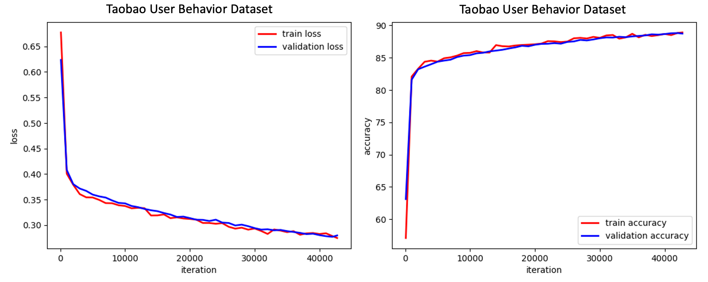

Time-based Sequence Model for Personalization and Recommendation Systems
========================================================================
*Copyright (c) Facebook, Inc. and its affiliates.*


Model description
------------------

TBSM consists of an embedding layer and time series layer (TSL).

The embedding layer is implemented through (DLRM). Within this layer
all sparse features pass through embeddings, while dense features
pass through MLP. The MLP maps dense features into the vector space of
the same dimension as the embedding dimension for all sparse features.
In the next step the vector of all pairwise inner products between
embedded sparse and mapped dense features is formed. Finally, this
vector of inner products is concatenated with an output vector from MLP
and passed through the top MLP, which produces a vector z of dimensions n.

Let us denote z_i the history of items, and z_t the last item. The TSL layer
computes one or more context vectors c. It ressembles an attention mechanism,
and contains its own MLP network with trainable parameters. The attention MLP
takes a vector of inner products between normalized z_i and z_t and outputs
the vector of coefficients a which is applied to z_i  to obtain the context
vector c. In this way, c measures the significance of each of the z_i with respect
to vector z_t. For example, if the first component of a is 1 while the rest are 0,
then c = z_0. The distinction with standard attention mechanisms lies in the
normalization (spherical projection) use of well defined inner products and
use of individual rather than shared MLP for multiple context vectors.

The final step takes vectors [z_t, c_j] and passes them through MLPs
resulting in the probability of a click.

```
   model:
               probability of a click
                         |
                        /\
                       /__\
                         |
              _________ op ___________
            /            |            \
  (context) c                 (candidate) z_t
  (vector )                   (embedding)
              \                     /
                 \                 /
                     attention    /
                     /       \   /
                    H           z_t
                  /             |
                 /              |
              DLRM            DLRM
              /                 |
   user history             new item

 model components
 i) Embedding layer (DLRM)
                    item tower output vector z
                               |
                              /\
                             /__\
                               |
       _____________________> Op  <___________________
     /                         |                      \
    /\                        /\                      /\
   /__\                      /__\           ...      /__\
    |                          |                       |
    |                         Op                      Op
    |                    ____/__\_____           ____/__\____
    |                   |_Emb_|____|__|    ...  |_Emb_|__|___|
 item input:
 [ dense features ]     [sparse indices] , ..., [sparse indices]

 ii) TSL layer, processing history (a sequence of vectors used in the attention)

          z1,       z2,   ...   zk   -->   H = [z1, z2, ..., zk]
          |         |           |
         DLRM,     DLRM, ...   DLRM
          |         |           |
 previous i1       i2   ...    ik features

 TSL functions similarly to attention mechanism, with three important distinctions
 a. The vectors are normalized (spherical projection)
 b. The product between vectors can be done using: dot v'w, indefinite v' A w and
    positive semi-definite v' (A'A) w inner product
 c. The multiple TSL heads have individual rather than shared output MLPs
```

  Cite [Work](https://arxiv.org/abs/2008.11922):
```
@article{TBSM20,
  author    = {T. Ishkhanov, M. Naumov, X. Chen, Y. Zhu, Y. Zhong, A. G. Azzolini, C. Sun, F. Jiang, A. Malevich, L. Xiong},
  title     = {Time-based Sequence Model for Personalization and Recommendation Systems},
  journal   = {CoRR},
  volume    = {abs/2008.11922},
  year      = {2020},
  url       = {https://arxiv.org/abs/2008.11922},
}
```

Implementation
---------------
**TBSM PyTorch**. Implementation of TBSM in PyTorch framework:
```
    tbsm_pytorch.py
```
**TBSM Data**. Implementation of data generation and pre-processing:
```
    tbsm_data_pytorch.py, tbsm_synthetic.py, tools/taobao_prepare.py
```
**Dependencies**.
[DLRM](https://github.com/facebookresearch/dlrm)

The model supports the following options

`--mode` can be "train", "test", or "train-test" depending on whether we train,
test (AUC metric) or both train and test the model. If "test" option is used,
model needs to exist at --save-model location.

`--model-type` can be tsl, mha or rnn, corresponding to the use of TSL, multi-head
attention or RNN based on LSTM cells time series processing mechnanisms.

`--tsl-inner` can be dot, ind or def corresponding to cases of dot product, indefinite,
positive semi-definite inner products.

`--tsl-proj` can be true or false. If true spherical projection is applied.

`--tsl-seq` can be true or false. If true k-sequences method is used within TSL.

`--num-train-pts` is a number of lines in *taobao_train.txt* used for training

`--num-val-pts` is a number of lines in *taobao_train.txt* used for validation

The full argument parameter list (example):

```
  python tbsm_pytorch.py  with the following arguments
  --dlrm-path="../dlrm"
  --mode="train-test"
  --model-type="tsl"
  --save-model=./tbsm_model.pt
  --num-train-pts=100
  --num-val-pts=20
  --points-per-user=10
  --mini-batch-size=256
  --nepochs=1
  --use-gpu
  --device-num=0
  --numpy-rand-seed=123
  --arch-embedding-size="987994-4162024-9439"
  --print-freq=100
  --test-freq=1000
  --num-batches=0
  --raw-train-file=./data/taobao_data/taobao_train.txt
  --raw-test-file=./data/taobao_data/taobao_test.txt
  --pro-train-file=./data/taobao_data/taobao_train_t20.npz
  --pro-val-file=./data/taobao_data/taobao_val_t20.npz
  --pro-test-file=./data/taobao_data/taobao_test_t20.npz
  --ts-length=20
  --attn-interaction-op="dot"
  --attn-mechanism="mlp"
  --learning-rate=0.05
```

Testing (using synthetic data)
------------------------------

To run the test provide the script with the path to where you saved [DLRM](https://github.com/facebookresearch/dlrm) :

    ./test/tbsm_test.sh <path_to_dlrm>

Output in debug mode:
```
dlrm path:  ../dlrm
model_type:  tsl
time series length:  20
seed:  123
model_file: ./data/taobao_data/model.pt
use-gpu: False
Reading pre-processed data=./data/taobao_data/train.npz
Reading pre-processed data=./data/taobao_data/val.npz
selected seed: 123
model_file:  ./data/taobao_data/model.pt
model_type:  tsl
Using CPU...
tsl
[1 4]
[10  2  2]
[5 4 3]
initial parameters (weights and bias):
ams.0.mlp.0.weight
[[ 0.5008   0.24341 -0.0949  -0.32741 -0.22085 -0.36559  0.62929  0.04958
   0.3468  -0.38212  0.05458  0.35514 -0.10101  0.31089 -0.32701 -0.4111
   0.11439 -0.11433  0.19359 -0.59636]
 [ 0.21476  0.78342 -0.00743  0.01029  0.05414 -0.56141  0.12849 -0.48405
  -0.12895  0.37474 -0.22168  0.15113  0.30535  0.08404 -0.41336 -0.10025
   0.59078 -0.61057 -0.08315 -0.16647]]
ams.0.mlp.0.bias
[0.08538 0.52907]
ams.0.mlp.2.weight
[[ 1.13752 -0.19108]
 [ 0.57441  0.35337]]
ams.0.mlp.2.bias
[ 0.33541 -0.39875]
ams.0.mlp.4.weight
[[-0.3007  -0.33168]
 [-0.22807  0.09699]
 [ 0.22943  0.09753]
 [-0.16552  0.54452]
 [ 0.45796 -0.10674]
 [-0.24827  0.03926]
 [ 0.3821   0.10033]
 [ 0.16781 -0.06394]
 [ 0.13757  0.4657 ]
 [-0.07226  0.04321]
 [ 0.07653  0.08555]
 [-0.4257  -0.5659 ]
 [-0.30744  0.05064]
 [ 0.16699 -0.16   ]
 [ 0.41526 -0.04317]
 [ 0.00613 -0.05848]
 [ 0.04041  0.21241]
 [ 0.2007  -0.27088]
 [ 0.4594  -0.33016]
 [ 0.02389 -0.08273]]
ams.0.mlp.4.bias
[-0.23456 -0.0168  -0.16565  0.0163   0.09013  0.32913  0.06873 -0.13667
 -0.08757  0.0313   0.0209   0.32637  0.31201 -0.08026 -0.12268 -0.57177
 -0.12274 -0.2187  -0.07934  0.08756]
mlps.0.0.weight
[[ 0.0886  -0.01498  0.09979 -0.06306]
 [ 0.09851 -1.61553 -0.13465 -0.05543]
 [-0.17063 -0.10897  0.35166 -0.29905]
 [ 1.10035  0.34415 -0.00315 -0.10333]]
mlps.0.0.bias
[-0.04326 -0.45765 -0.0476   0.13934]
mlps.0.2.weight
[[ 0.36653  0.36663 -0.17385 -0.89561]]
mlps.0.2.bias
[-0.6691]
dlrm.emb_l.0.weight
[[ 0.17573 -0.19128 -0.24431  0.0459 ]
 [ 0.1963  -0.06878  0.43001  0.16532]
 [-0.01706 -0.09649 -0.14027  0.20487]
 [-0.05494 -0.39384 -0.09119  0.21287]
 [-0.28399 -0.29028  0.02822  0.02847]]
dlrm.emb_l.1.weight
[[ 0.1344   0.34943  0.22446  0.11102]
 [ 0.22244 -0.17704 -0.13821 -0.27174]
 [-0.20629  0.13098 -0.4079  -0.0663 ]
 [-0.06914 -0.00631 -0.07417 -0.18774]]
dlrm.emb_l.2.weight
[[-0.08504  0.45425  0.51287  0.00212]
 [ 0.14313 -0.44385 -0.21098 -0.09835]
 [ 0.42298 -0.28815 -0.01959  0.56068]]
dlrm.bot_l.0.weight
[[1.51306]
 [0.26115]
 [0.61901]
 [1.41553]]
dlrm.bot_l.0.bias
[-0.64704 -0.51939  0.87186 -0.39903]
dlrm.top_l.0.weight
[[ 0.01212  0.43655  0.36363  0.71643  0.61059  0.43658 -0.31546  0.3245
   0.1283  -0.54145]
 [ 0.57861  0.32955  0.01857 -0.09516 -0.4892   0.08146  0.19124 -0.33932
   0.47447 -0.44793]]
dlrm.top_l.0.bias
[-1.50126  0.7352 ]
dlrm.top_l.2.weight
[[-0.28522 -0.08912]
 [-0.59221 -1.13559]]
dlrm.top_l.2.bias
[ 0.88759 -0.4871 ]
time/loss/accuracy (if enabled):
Finished training it 4/4 of epoch 0, -1.00 ms/it, loss 4.25846115, accuracy 49.000 %
At epoch 0 validation accuracy is 45.000 %
Saving current model...
final parameters (weights and bias):
ams.0.mlp.0.weight
[[ 0.5008   0.24341 -0.0949  -0.32741 -0.22085 -0.36559  0.62929  0.04958
   0.3468  -0.38212  0.05458  0.35514 -0.10101  0.31089 -0.32701 -0.4111
   0.11439 -0.11433  0.19359 -0.59636]
 [ 0.36136  0.93002  0.13918  0.15689  0.20074 -0.41481  0.27509 -0.33745
   0.01765  0.52134 -0.07508  0.29773  0.45195  0.23064 -0.26676  0.04636
   0.73738 -0.46397  0.06345 -0.01987]]
ams.0.mlp.0.bias
[0.08538 0.67567]
ams.0.mlp.2.weight
[[ 1.13752 -0.24108]
 [ 0.57441  0.4974 ]]
ams.0.mlp.2.bias
[ 0.28541 -0.25983]
ams.0.mlp.4.weight
[[-0.3507  -0.47231]
 [-0.27807 -0.04458]
 [ 0.17943 -0.044  ]
 [-0.21552  0.40317]
 [ 0.40796 -0.24824]
 [-0.29827 -0.10244]
 [ 0.3321  -0.04126]
 [ 0.11781 -0.20529]
 [ 0.08757  0.32415]
 [-0.12226 -0.09835]
 [ 0.02653 -0.05603]
 [-0.4757  -0.70718]
 [-0.35744 -0.09105]
 [ 0.11699 -0.30126]
 [ 0.36526 -0.18456]
 [-0.04387 -0.19951]
 [-0.00959  0.0708 ]
 [ 0.1507  -0.41171]
 [ 0.4094  -0.47107]
 [-0.02611 -0.22425]]
ams.0.mlp.4.bias
[-0.35349 -0.13781 -0.28623 -0.10426 -0.03116  0.20792 -0.05257 -0.25687
 -0.20853 -0.08967 -0.10011  0.20554  0.1909  -0.20036 -0.24294 -0.69081
 -0.24373 -0.33748 -0.1987  -0.03343]
mlps.0.0.weight
[[ 0.22952 -0.01498  0.24368 -0.06306]
 [ 0.23989 -1.61553  0.0097  -0.05543]
 [-0.17063 -0.10897  0.35166 -0.29905]
 [ 0.97246  0.34415 -0.13412 -0.10333]]
mlps.0.0.bias
[ 0.10063 -0.31331 -0.0476   0.00837]
mlps.0.2.weight
[[ 0.52473  0.53608 -0.17385 -0.7676 ]]
mlps.0.2.bias
[-0.53416]
dlrm.emb_l.0.weight
[[ 0.16653 -0.1196  -0.27872  0.03817]
 [ 0.24085 -0.12155  0.46954  0.20637]
 [ 0.04534 -0.16584 -0.08979  0.25463]
 [-0.05494 -0.39384 -0.09119  0.21287]
 [-0.28399 -0.29028  0.02822  0.02847]]
dlrm.emb_l.1.weight
[[ 0.1786   0.37884  0.26537  0.09071]
 [ 0.2182  -0.24451 -0.15467 -0.2798 ]
 [-0.23229  0.2483  -0.30968 -0.07674]
 [-0.06914 -0.00631 -0.07417 -0.18774]]
dlrm.emb_l.2.weight
[[-0.10893  0.39575  0.48345  0.01635]
 [ 0.17248 -0.46559 -0.29276 -0.15131]
 [ 0.52165 -0.34937  0.09883  0.64371]]
dlrm.bot_l.0.weight
[[1.50923]
 [0.26115]
 [0.62354]
 [1.45738]]
dlrm.bot_l.0.bias
[-0.63084 -0.51939  0.88702 -0.35255]
dlrm.top_l.0.weight
[[ 0.03634  0.43655  0.39555  0.74091  0.62785  0.30741 -0.4205   0.39894
   0.19587 -0.57733]
 [ 0.55833  0.32955  0.01597 -0.10637 -0.48417  0.13888  0.14035 -0.27671
   0.46094 -0.43674]]
dlrm.top_l.0.bias
[-1.4672   0.73397]
dlrm.top_l.2.weight
[[-0.30207 -0.07442]
 [-0.59221 -1.13559]]
dlrm.top_l.2.bias
[ 0.8788 -0.4871]
```

Benchmarking (using Taobao data)
-------------------------------

The code supports interface with the [Taobao User Behavior Dataset](https://tianchi.aliyun.com/dataset/dataDetail?dataId=649&userId=1).
- Please do the following to prepare the dataset for use with TBSM code:
    - Download UserBehavior.csv.zip and UserBehavior.csv.zip.md5 into directory
      ```
      ./data/taobao_data
      ```
    - Check the md5sum hash and unzip
       ```
       md5sum UserBehavior.csv.zip
       unzip UserBehavior.csv.zip
       ```
    - Run preprocessing to create input files (*taobao_train.txt* and *taobao_test.txt*)
       ```
       python ./tools/taobao_prepare.py
       ```
- The model can be trained using the following script
  ```
  ./bench/tbsm_bench.sh <path_to_dlrm>
  ```




Taobao Data generation
----------------------

The TBSM implementation assumes that we have *taobao_train.txt* and *taobao_test.txt*
files. It further processes each of these files into datapoints, where each
datapoint is a time series of items + final item per user. The label "y" is
binary indicating whether the final item is drawn from the same time series for some
user (y = 1), or is randomly chosen (y = 0). Number of positive and negative
samples is kept close to 50/50.

The original *taobao_train.txt* and *taobao_test.txt* have the following format:
```
uid, iid, cid, label,    i1,...,i200   ic1,...,ic200  j1,...j200  jc1,...,jc200
```
For instance, here is an example of a single line
```
7 123 50 1     0,45,12,...123   0,17,89,...50    98,112,75,...   43,765,14
```

Here sequence of 200 i's is time-ordered sequence of items, ic's are their
respective categories. This is full user history. Sequence ic is completely
determined by i-sequence. Sequence of j's and jc's is a randomly generated sequence
of items and their categories guaranteed to have empty intersection with i-sequence.

Currently we build time series dataset as follows. For each user we generate ordered
contiguous subsets of fixed length from i-sequence (sample history). The last entry
for positive sample comes from a next point of i-sequence, while for negative sample
from last point.

The code receives
```
--raw-train-file=./data/taobao_data/taobao_train.txt
--raw-test-file=./data/taobao_data/taobao_test.txt
```
text files, while it produces
```
--pro-train-file=./data/taobao_data/train.npz
--pro-val-file=./data/taobao_data/val.npz
--pro-test-file=./data/taobao_data/test.npz
```
processed .npz files, which are reused across runs.


Model checkpoint saving/loading
-------------------------------

During training, the model can be saved using `--save-model=./tbsm.pt` If the file
exists at that location prior to model computation, model is loaded from there and
computation starts with that model. The model is saved if there is an improvement
in validation accuracy, which is checked at `--test-freq` intervals.

A previously saved model can be loaded using `--load-model=./tbsm.pt`. Once loaded
the model can be used to continue training, with the saved model being a checkpoint.
Alternatively, the saved model can be used to evaluate only on the test dataset
by specifying `--inference-only` option.


Version
-------
0.1 : Initial release of the TBSM code

Requirements
------------
pytorch-nightly (*7/30/20*)

scikit-learn

pandas

numpy

cPickle

License
-------
This source code is licensed under the MIT license found in the
LICENSE file in the root directory of this source tree.
